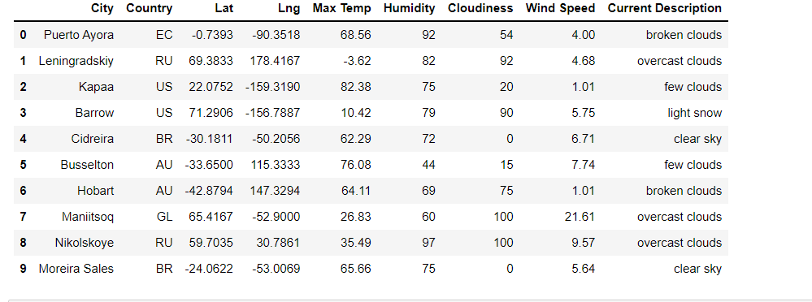
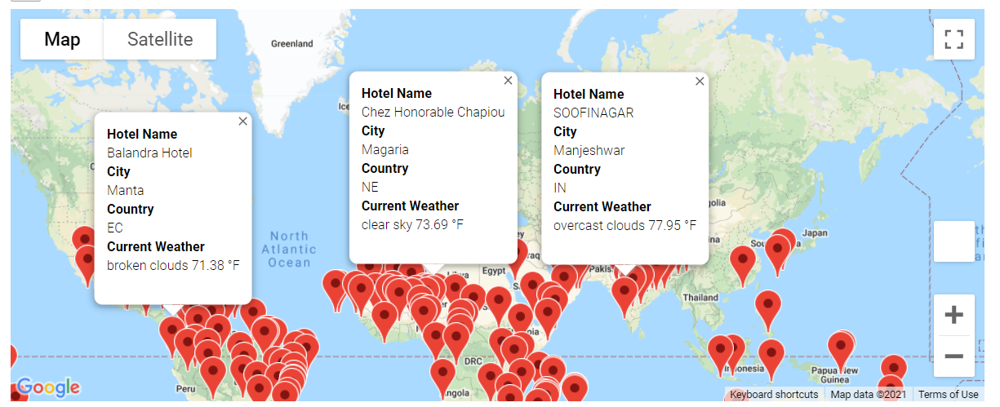
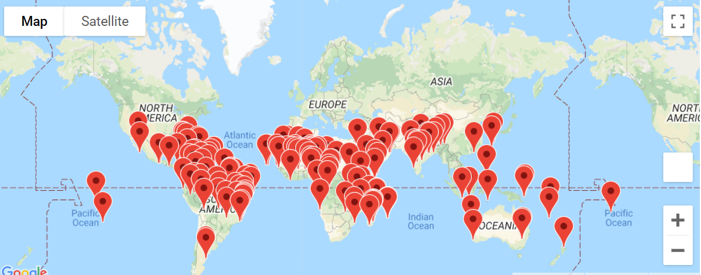
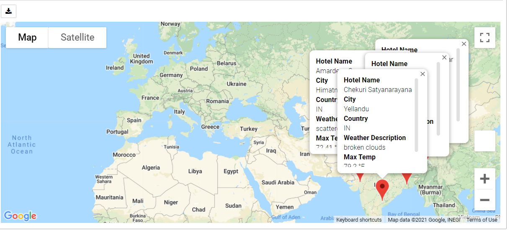

# World_Weather_Analysis
  This module covers requirement of adding weather data details to the PlanTrip app. Additionaly there are use case scenarios to filter the data for weather preferences, which will then be used to identify potential travel destinations and nearby hotels. This module concludes with choosing four cities to create a travel itineray and then ending with usage of Google Maps Directions API between four cities along with a marker layer map.

  ## Deliverable 1
    ### Creation of a new DataFrame containing the updated weather data.

    Weather_Database code  contains creation of a weather database using randomly generated lat-long pairs and the OpenWeatherMap API. Weather attributes like Latitude, Longtitude, Maximum temperature, Percent humidity, Percent cloudiness, Wind Speed and Weather description are retrieved from the API call
   
    

  ## Deliverable 2

    Weather database generates a new randomized set of lat-long pairs, matches them to cities, retrieves weather data, and stores all in a dataframe and then exported to CSV. Then a map was used to display hotel locations that match the input criteria. Google maps API was then used to locate hotels in the cities that were filteres with pop up markers that show hotel name, location, weather description and maximum temperature in Fahrenheit.

    
    

  ## Deliverable 3
    Last of the project was to build an itenary that shows the route between 4 cities that were chosen. Add on of marker layer was done and then pop up markers showed additional hotel details

 
        
     
    

    

    
